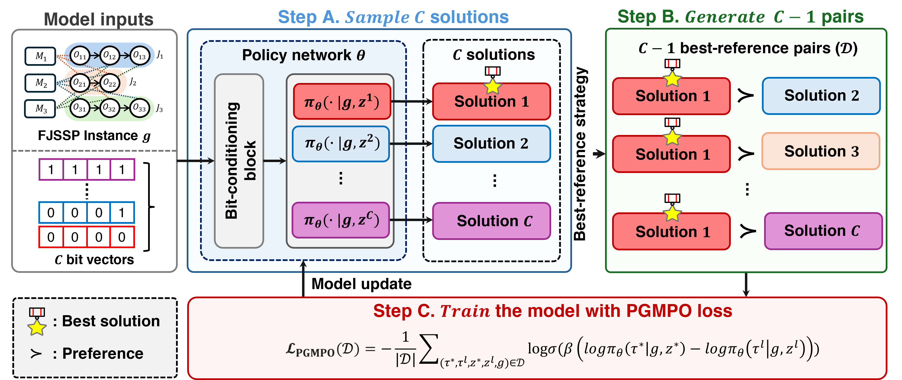

<h1 align="center">
Preference-Guided Multi-Policy Optimization for 
  
Flexible Job Shop Scheduling
</h1>

  
  

This repository is the official implementation of our paper **Preference-Guided Multi-Policy Optimization for Flexible Job Shop Scheduling**, accepted at 35th International Joint Conference on Artificial Intelligence (IJCAI 2026). The code builds upon [DAN](https://github.com/wrqccc/fjsp-drl) repository.

The paper reports experiments on SD1 and four benchmark datasets. This repository also supports training and evaluation on SD2. In our experiments, PGMPO consistently outperformed the original DAN trained on 10×5 instances, both in-distribution (10×5) and out-of-distribution (30×10 and 40×10).

  

# **Quick Start**

### **Requirements**
- `python=3.10.14`
- `torch==2.2.2`
- `numpy==1.24.3`
- `argparse==1.1`
- `tqdm==4.66.4`
---
### **File Introduction**
- `data`: Stores test instances (BenchData, SD1, and SD2).

- `model`: Provides the implementation of the proposed framework.

- `or_solution`: Stores solutions obtained using Google OR-Tools.

- `test_results`: Stores test results.

- `train_log`: Stores training log (mean makespan).

- `trained_network`: Stores the trained model checkpoints

- `common_utils.py`: Provides utility functions.

- `data_utils.py`: Handles data generation, data loading, and format conversion.

- `fjsp_env_same_op_nums/fjsp_env_various_op_nums.py`: Implements the FJSP environment for instances with the same/varying numbers of operations.

- `params.py`: Parameter settings.

- `test_trained_model.py`: Evaluates trained models.

- `train_model.py`: Trains the DAN using PGMPO.
---
### **Train**
Run `train_model.py` to start training. The current training configuration is set for the **10×5 SD1 dataset**, while all other parameters follow the settings used in the paper. Training configurations can be easily modified in `params.py`.
- Example:
  - `--n_j ` and `--n_m `: Number of jobs and machines for training.
  - `--data_source`: Dataset source for training (SD1 or SD2).

---
### **Test**
Run `test_trained_model.py` to evaluate the trained model. The current test configuration is set for the **10×5 SD1 test instances**, while all other parameters follow the settings used in the paper. Test configurations can be easily modified in `params.py`.
- Example:
  - `--data_source`: Source of testing instances (SD1 or SD2)
  - `--model_source `: Source of instances that the model trained on (SD1 or SD2)
  - `--test_data `: Instance names for testing.
  - `--test_model  `: Model names for testing.
